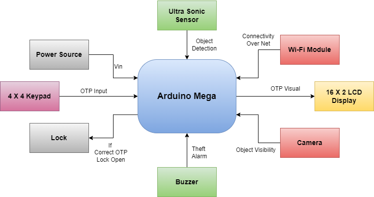
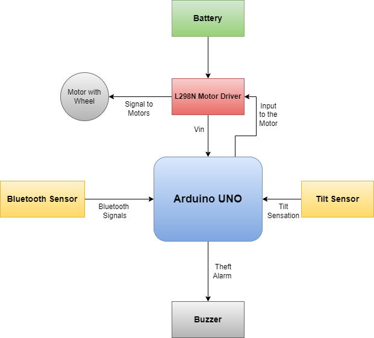

# Anti-Theft-Ecommerce-Delivery-vehicle
The enhanced anti-theft e-commerce delivery vehicle is a cutting-edge solution designed to ensure secure and efficient package delivery. It incorporates advanced technologies and features to safeguard packages, deter theft attempts, and provide a seamless delivery experience. Here is an improved version of the previous description:

Robust Hardware Integration:
The vehicle integrates both the Arduino UNO and Arduino Mega boards to ensure optimal performance and control. This combination enables seamless communication and coordination between various components.

Remote Control and Navigation:
The vehicle is equipped with a four-wheel drive system and can be remotely controlled using a RF remote. This allows for precise maneuvering and navigation, ensuring smooth and efficient delivery operations.

Secure Package Compartment:
The vehicle features an upper section specifically designed to carry packages. This compartment incorporates an advanced locking mechanism that can only be opened by the intended recipient. This anti-theft mechanism ensures the safety and integrity of the packages during transit.

Object Detection and Collision Avoidance:
To enhance safety and prevent accidents, the vehicle is equipped with an ultrasonic sensor. This sensor continuously scans the surroundings and detects any obstacles or pedestrians. It enables the vehicle to avoid collisions and ensures the delivery process is carried out without any disruptions.

Anti-Theft Measures:
In order to deter theft attempts, the vehicle is equipped with a comprehensive anti-theft system. It includes a buzzer that generates loud noise upon any unauthorized access or tampering. Additionally, a siren system is installed to attract attention and alert nearby individuals in case of a theft attempt.

Powerful Drive System:
The vehicle employs a robust four-wheel DC motor drive system, enabling it to transport packages weighing up to 10 kg. This powerful drive system ensures smooth movement across various terrains, making it suitable for both urban and suburban delivery environments.

Remote Monitoring and Tracking:
For efficient management and tracking, the vehicle incorporates remote monitoring capabilities. This allows the delivery service provider to remotely monitor the vehicle's location, performance, and status, ensuring real-time visibility and control.

By combining advanced hardware integration, secure package compartment, collision avoidance technology, and anti-theft measures, the enhanced anti-theft e-commerce delivery vehicle provides a reliable and secure solution for efficient package delivery. Its ability to deter theft attempts, ensure safe transportation, and deliver packages with precision makes it an ideal choice for e-commerce companies focused on customer satisfaction and security.

# BluePrint
## Arduino Mega Connection

## Arduino Uno Connection

